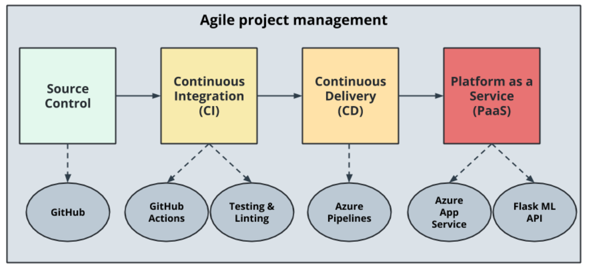
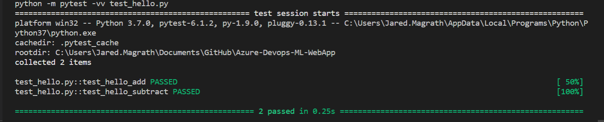
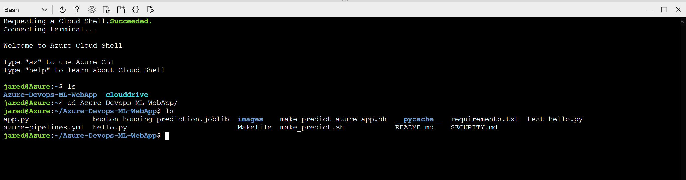
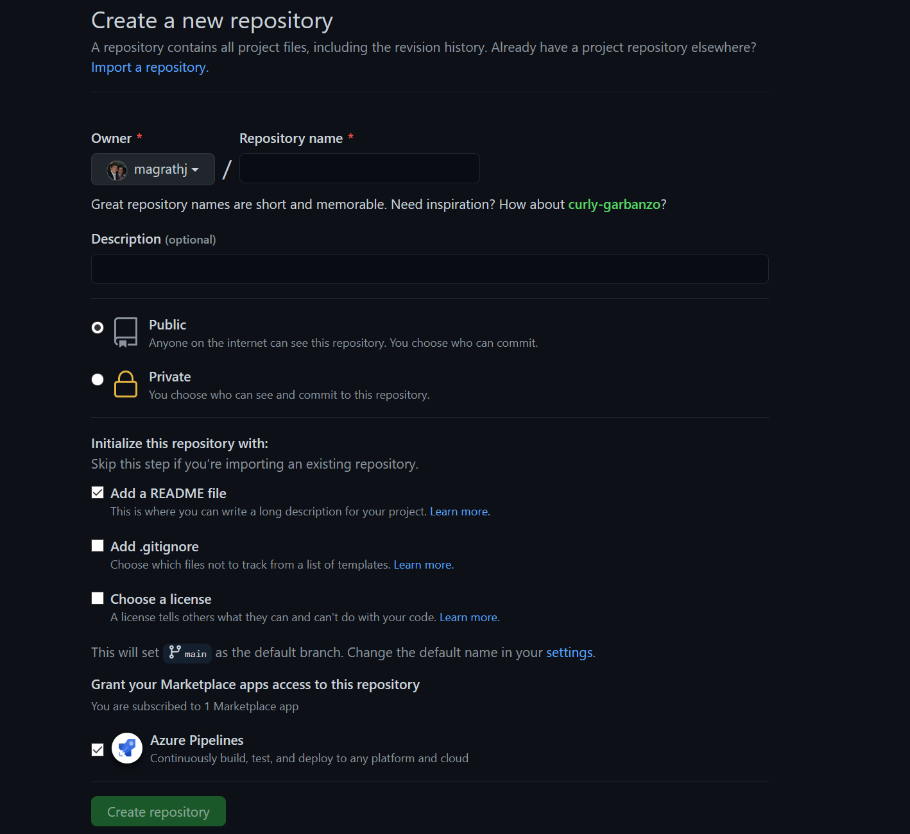
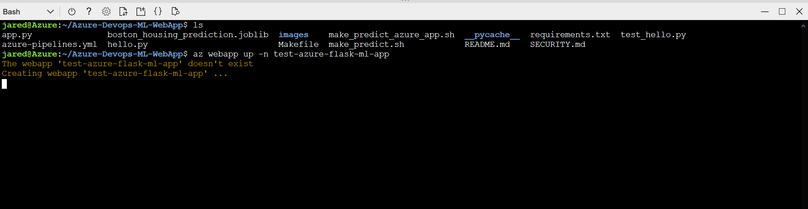
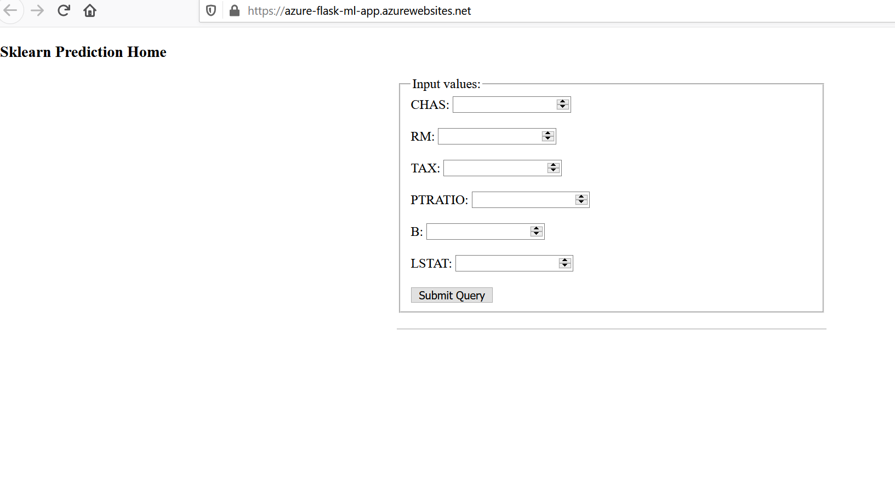
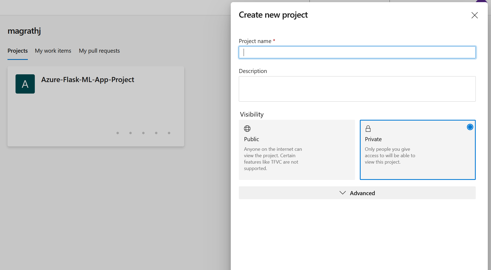
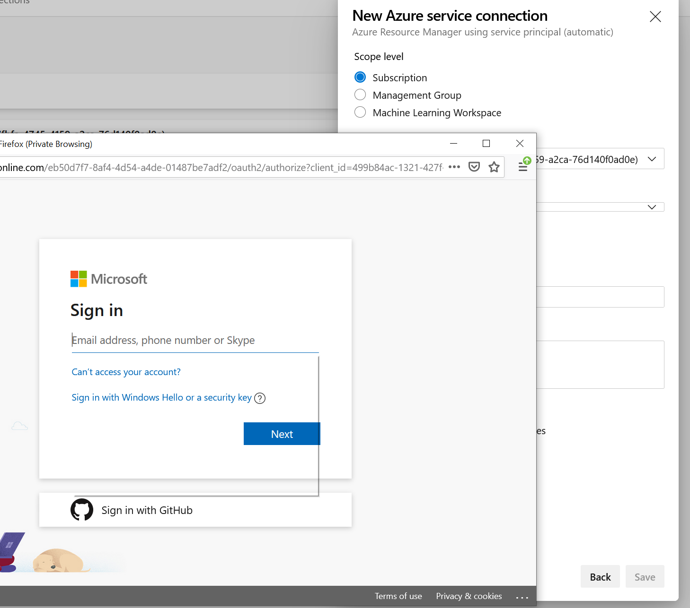

# Azure-Devops-ML-WebApp

Current Status (badge)
[](https://dev.azure.com/magrathj/Azure-Flask-ML-App-Project/_build/latest?definitionId=3&branchName=main)


## Introduction

This repo contains a machine learning flask web app, with CI/CD component, built out using the agile framework. It has two build components, a github actions and azure pipelines build, to act as gates for deployment and to promote code to different environments. 


[Machine Learning Web App](https://azure-flask-ml-app.azurewebsites.net/)

## Project Plan


***Table timeline for project***

| Week   |      Front end      |  Back end |
|----------|:-------------:|------:|
| 28/12/2020 |  Add flask app code | Create project skeleton |
| 04/01/2021 |  Add hello world home page   |   Create github action |
| 11/01/2021 |  Add button to invoke API |  Add sklearn model request call   |
| 18/01/2021 |  Add a return page to display API response |  Convert github action to azure pipeline    |
| 25/01/2021 |  Add UI tests |    Add test for APIs |
| 01/02/2021 |  QA for UI |    QA for APIs |
| 08/02/2021 |  Demo UI functionality |    Demo API calls |
| 15/02/2021 |  Cosmetic changes to UI |    Technical tebt - clean up of repo |
| 21/02/2021 |  End to End demo |    End to End demo |

## Instructions

# flask-ml-azure-serverless
Deploy Flask Machine Learning Application on Azure App Services



## To run it locally follow these steps

1.  Create virtual environment and source

```bash
python3 -m venv ~/.flask-ml-azure
source ~/.flask-ml-azure/bin/activate
```

2.  Run `make install` and Run `make test`




3.  Run `python app.py`

4.  In a separate shell run: `./make_prediction.sh`

## To run it in Azure Pipelines

1.  Refer to [Azure Official Documentation guide here throughout](https://docs.microsoft.com/en-us/azure/devops/pipelines/ecosystems/python-webapp?view=azure-devops)

2. Launch Azure Shell  





3.  Create Github Repo with Azure Pipelines Enabled (Could be a fork of this repo)



4. Clone the repo into Azure Cloud Shell


``` bash 
    git clone https://github.com/magrathj/Azure-Devops-ML-WebApp.git
```


5.  Create virtual environment and source

```bash
    python3 -m venv ~/.flask-ml-azure
    source ~/.flask-ml-azure/bin/activate
```

2.  Run `make install`

3.  Create an app service and initially deploy your app in Cloud Shell

`az webapp up -n <your-appservice>`



4. Verify deployed application works by browsing to deployed url: `https://<your-appservice>.azurewebsites.net/`

You will see this output:




5.  Verify Machine Learning predictions work

Change the line in `make_predict_azure_app.sh` to match the deployed prediction
`-X POST https://<yourappname>.azurewebsites.net:$PORT/predict `


6. [Create an Azure DevOps project and connect to Azure, (as official documentation describes)](https://docs.microsoft.com/en-us/azure/devops/pipelines/ecosystems/python-webapp?view=azure-devops)



7.  Connect to Azure Resource Manager



8.  Configure connection to previously deployed resource group


9.  Create new Python Pipeline with Github Integration


This process will create a YAML file that looks roughly like the YAML output shown below.  Refer to the [official Azure Pipeline YAML documentation for more information about it](https://docs.microsoft.com/en-us/azure/devops/pipelines/ecosystems/python-webapp?view=azure-devops#yaml-pipeline-explained).

```
# Python to Linux Web App on Azure
# Build your Python project and deploy it to Azure as a Linux Web App.
# Change python version to one thats appropriate for your application.
# https://docs.microsoft.com/azure/devops/pipelines/languages/python

trigger:
- master

variables:
  # Azure Resource Manager connection created during pipeline creation
  azureServiceConnectionId: '<youridhere>'
  
  # Web app name
  webAppName: 'flask-ml-service'

  # Agent VM image name
  vmImageName: 'ubuntu-latest'

  # Environment name
  environmentName: 'flask-ml-service'

  # Project root folder. Point to the folder containing manage.py file.
  projectRoot: $(System.DefaultWorkingDirectory)
  
  # Python version: 3.7
  pythonVersion: '3.7'

stages:
- stage: Build
  displayName: Build stage
  jobs:
  - job: BuildJob
    pool:
      vmImage: $(vmImageName)
    steps:
    - task: UsePythonVersion@0
      inputs:
        versionSpec: '$(pythonVersion)'
      displayName: 'Use Python $(pythonVersion)'
    
    - script: |
        python -m venv antenv
        source antenv/bin/activate
        python -m pip install --upgrade pip
        pip install setup
        pip install -r requirements.txt
      workingDirectory: $(projectRoot)
      displayName: "Install requirements"

    - task: ArchiveFiles@2
      displayName: 'Archive files'
      inputs:
        rootFolderOrFile: '$(projectRoot)'
        includeRootFolder: false
        archiveType: zip
        archiveFile: $(Build.ArtifactStagingDirectory)/$(Build.BuildId).zip
        replaceExistingArchive: true

    - upload: $(Build.ArtifactStagingDirectory)/$(Build.BuildId).zip
      displayName: 'Upload package'
      artifact: drop

- stage: Deploy
  displayName: 'Deploy Web App'
  dependsOn: Build
  condition: succeeded()
  jobs:
  - deployment: DeploymentJob
    pool:
      vmImage: $(vmImageName)
    environment: $(environmentName)
    strategy:
      runOnce:
        deploy:
          steps:
          
          - task: UsePythonVersion@0
            inputs:
              versionSpec: '$(pythonVersion)'
            displayName: 'Use Python version'

          - task: AzureWebApp@1
            displayName: 'Deploy Azure Web App : flask-ml-service'
            inputs:
              azureSubscription: $(azureServiceConnectionId)
              appName: $(webAppName)
              package: $(Pipeline.Workspace)/drop/$(Build.BuildId).zip
  ```
10.  Verify Continuous Delivery of Azure Pipelines by changing `app.py`

You can watch this [YouTube Walkthrough of this process](https://youtu.be/iD9_9JZt-J0)


